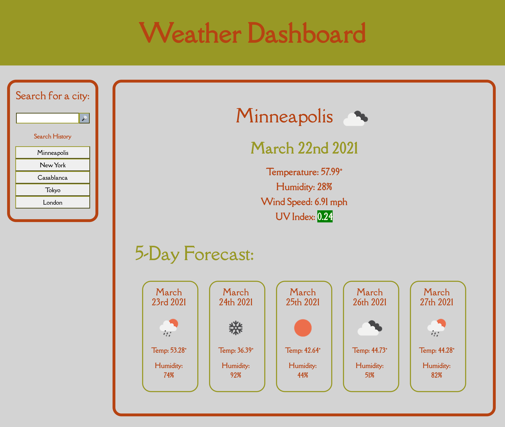

# Weather-Dashboard

GOAL: 

The overall goal of this project was to create a weather dashboard from scratch. 

In order to achieve this goal, I was supposed to incorporate an assigned server-side API, the OpenWeather API. I was also assigned to make use of the browser's local storage feature.

The weather dashboard was supposed to give the weather outlook for multiple chosen cities, and contain these specific features:

- A form input where, when the user searches for a specific city, they are shown the city's current and future weather;
- Once the input is searched, it is put into a search history;
- The current weather information includes the city name, a weather icon, today's date, the humidity, the wind speed, and the UV index;
- Attached to the UV index, the user is presented with a color representation of its severity;
- A 5-day forecast for the city is incorporated, and each day shows the date, an icon representing the weather conditions, the temperature for that day, and the humidity for that day;
- If the user clicks on items in the search history, they are once again presented with the weather information for the particular city attached to that item. 

This is an image of the final product:

PROCESS: 

For this project, I started out by reviewing the logic and syntax of how to incorporate server-side APIs into the JavaScript format. At this point, I also studied the specifics of the OpenWeather API, chosing the relevant data for my purposes, and looking into how to call said data. 

After reviewing the requirements of the assignment, I drew on paper a mock-up of my webpage, which was inspired by the mock-up given with the project instructions. In this mock-up, I also wrote down the HTML elements associated with each section. 

From then, I started formatting the skeleton of the page in HTML, by referring to my mock-up. Once most of the skeleton was put in place, I was able to start styling the page in CSS, giving the webpage more life and a visual representation of the weather dashboard. I spent some time styling it, but left some of the details to the end. 

At this point, I started planning out the logic that would bring the webpage to life in JavaScript. I wrote pseudo-code in the JavaScript file, and kept adding more detailed pseudo-code along the way. This allowed me to work one step at a time, focusing on each particular element of the pseudo-code. 

The first thing I focused on in JavaScript was the functionality of the search button in relation to the input value. The actions associated with this button were created in this order: once the button is clicked, the city input was to go into local storage, and then be added to the page's search history. At the same time, it was supposed to fetch data from the API and insert it into the part of the page that displayed the results. I first completed the local storage and search history parts of the functionality. Once these were working correctly, I started coding with fetch() to extract the relevant data from the API. 

It took several small steps in order to succesfully retrieve data from the API, which involved studying the documentation and taking notes. This helped in making sure that the syntax I was using was correct, which I checked by using the console to see if there were any errors along the way and look for the required data. I quickly realized that I was going to need two different endpoints from the OpenWeather API, and made sure that they were connected by the appropriate variables. Once the functions were working as desired for both fetch() endpoints, I experimented with how to display the data on the page. This particular step took a very long time, as it took me a while to become familiar with the logic and the syntax of this process. I also had to figure out how I wanted to display the date, and ended up using Moment.js. Displaying the weather icons sucessfully was also challenging. 

Once I became familiar with how to display the current weather elements, I could easily apply what I had learned to the 5-day forecast elements as well. 

The last steps, as usual, involved cleaning up the code semantically and stylistically, putting some final touches to styling, and testing the webpage for functionality. 

CHALLENGES/NOTES: 

This project involved several challenging moments that required time, patience, and perseverance, followed by moments of ease. Once I broke through a barrier, the pieces of the coding puzzle would easily come together, as the logic started making a lot more sense. 

As with every webpage, there is room for improvement, both for the user and for the coder. I am pleased with the result, but would improve upon certain elements, given the time. For example, instead of the search history buttons being present on the page from the beginning, each button could be displayed only when the input is submitted. I also noticed that, if the user puts nothing in the input field and clicks the button, it clears the search history. 

In the code itself, I could improve on JavaScript. It is extremely long and, whereas it functions as desired, repeated code could be consolidated into loops. Loops in general are something I could improve on, and adding them to this particular code would be a great way to practice.

Overall, I have noticed that, as assignments become more and more complex and incorporate newer types of code, previously-studied code starts to seem much simpler, which is encouraging. 

Here is a live link to the Weather Dashboard:

https://mgdelneri.github.io/Weather-Dashboard/

